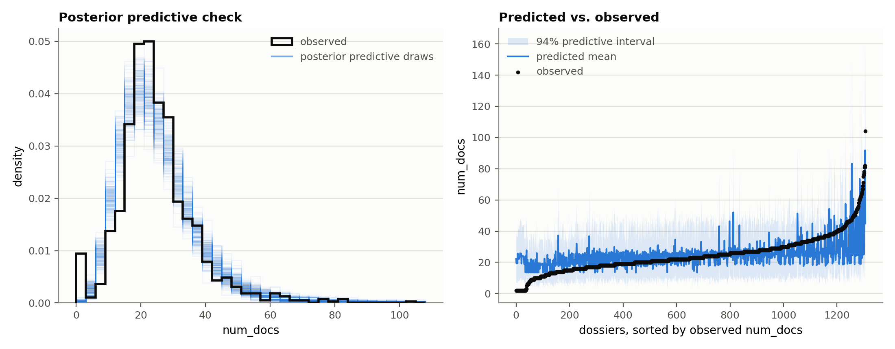
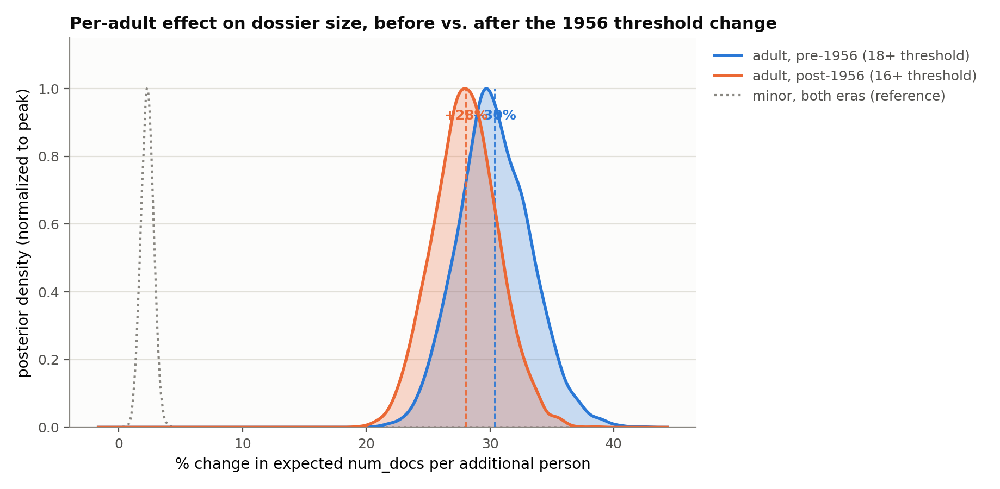
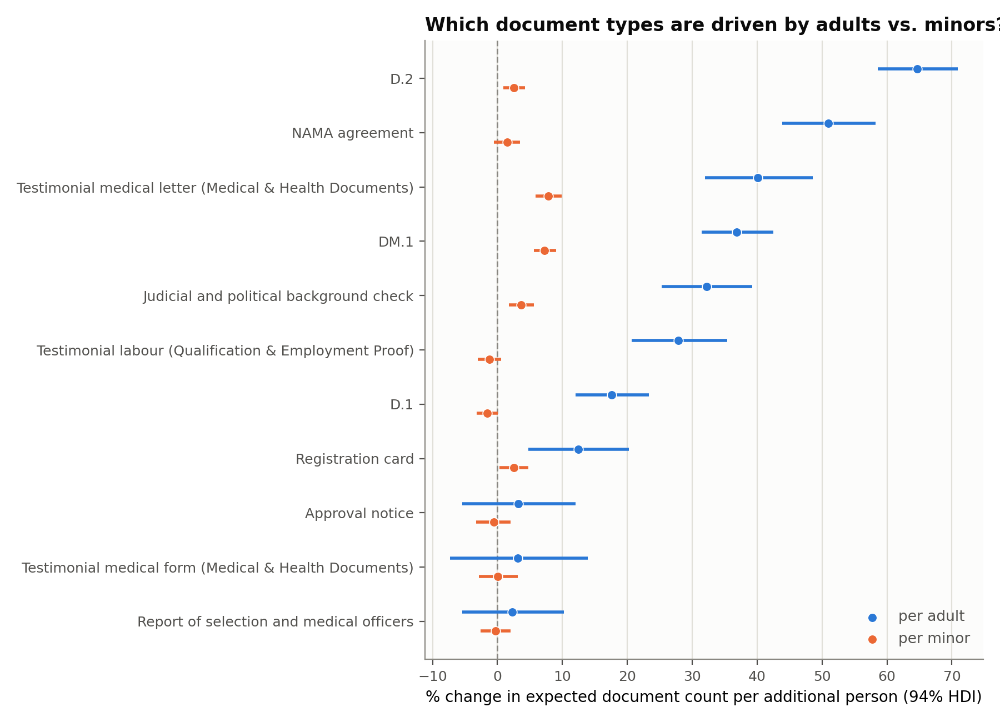
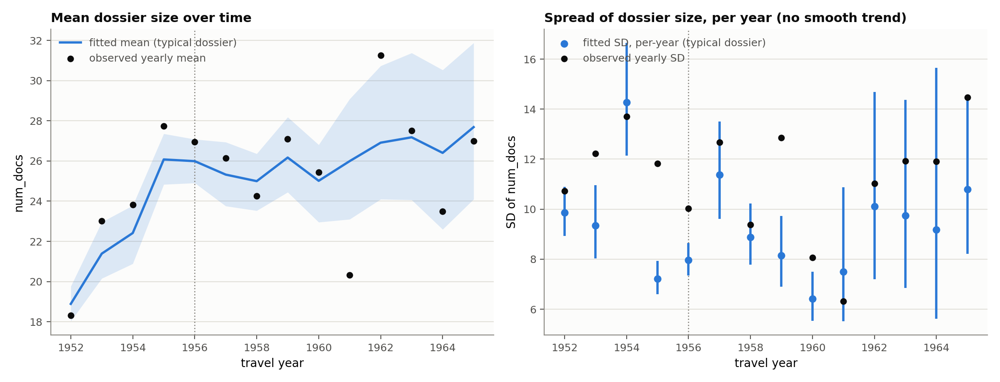
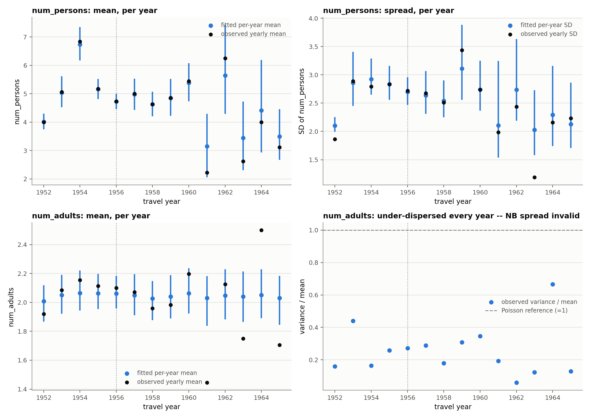
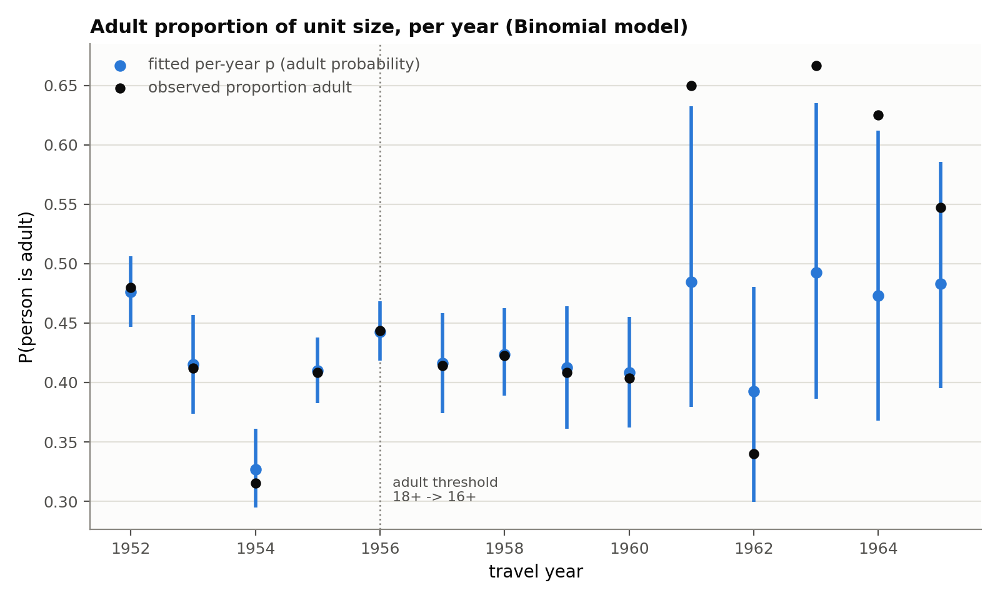
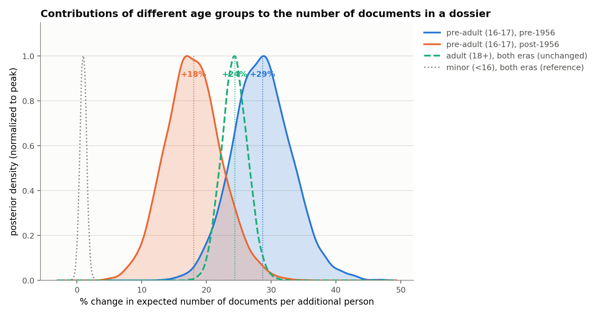
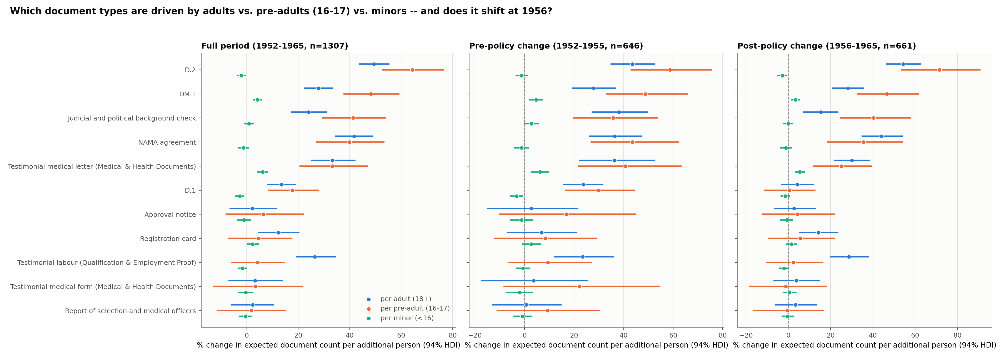

Dossier Size & Family Composition Analysis

Migration Dossiers · Size & Composition Analysis

# What predicts dossier size, and a correction along the way

A family of Bayesian models across 1,307 dossiers (1952–1965) tracing whether unit composition and time predict dossier size, plus a classifier-uncertainty recheck — including an initial finding that a later domain-expert conversation overturned, kept visible deliberately.

This report documents the full investigative arc as it happened, not just the final answer — §1–2 are **superseded** by §6–7 (and, on predictive grounds rather than a data bug, by §8's grid). §3, §6, and §7 additionally carry a classifier-uncertainty check (point estimate for §3/§6; both point estimate and full GPU multiple imputation for §7, see §10): the aggregate findings hold up essentially unchanged, the per-document-type story in §7 narrows, and point-mode/full-MI disagree on one type (D.2) -- see §7 for which reading to trust. Regenerate end to end with `make -C scripts/dossier_size_model all` (~1.5–2 hours; individual targets in `make help`); the uncertainty check is a separate step, `python3 scripts/dossier_size_model/aggregate_uncertainty.py` (point estimate) plus `doc_type_three_groups_uncertainty.py --mode mi` (GPU, full MI). 

**§1–2** originally: num_adults defined by an era-switching 18+/16+ threshold → "adult effect shrinks after 1956" (data bug, since fixed; refit here on corrected data)

**§3–5** temporal trend and family-composition side investigations

**§6** domain expert: the threshold never moved — a separate pre-adult (16-17) paperwork rule changed instead → corrected model

**§7** which specific document types drove it — and what that reveals about selection-officer discretion

**§8** all seven num_docs models on one footing — how many age groups, and does era matter

## §0 Method, throughout

Every model here is a negative binomial GLM[1] with a log link, fit with NUTS[2] via PyMC[3], using hierarchical partial pooling[4] for year-level (and, where noted, document-type-level) effects so sparse years or types borrow strength rather than being estimated in isolation. Structural questions (which predictor form, whether a temporal trend is real, which likelihood is appropriate) are answered by comparing models via LOO cross-validation[5] rather than by fitting one model and trusting it.

## §1 Does composition predict dossier size?

**Superseded by §6**  
This section's "adult"/"minor" covariates originally used an era-switching (18+ pre-1956, 16+ post-1956) definition -- later found to be a data-generation bug, not a real policy change. `ages_num_docs_pages.tsv` has since been corrected to a constant 18+ threshold throughout, and the models below are refit on that corrected data. Still superseded by §6's three-group model, but the reason has changed: it's no longer a data bug, it's that two groups is simply a coarser specification than three, and predicts decisively worse (see §8's model-comparison grid). Kept as the "(2) adult/minor" row of that grid, not as a historical reproduction of a since-fixed bug. 

Three models: A (num_docs ~ num_persons), B (~ num_adults + num_minors), C (B + adult×era interaction).

**B beats A decisively** (elpd diff 83.6, dse 12.1) — splitting persons into adults/minors predicts dossier size far better than raw group size: **29.1% [25.4%, 33.0%]** more documents per adult vs. **2.3% [1.4%, 3.3%]** per minor.

**C does not beat B** (elpd diff 0.2, dse 0.6 — not decisive): the adult×era interaction is null, -0.0% [-0.1%, 0.0%], no era effect on adults at all. This matches §6's finding that the legal adult threshold never moved. Worth being precise about what changed: the _original_ version of this model, fit on the era-switching data before it was corrected, showed a spuriously credible-looking shrink -- refitting on clean data doesn't just make that finding statistically indistinguishable from noise, it makes the effect disappear entirely, coefficient and LOO comparison both agreeing there's nothing here.

  
   
_posterior predictive check (density overlay and predicted-vs-observed)_   
  
   
_corrected data: no adult-effect shift at 1956 (contrast with §6's pre-adult-specific shift)_   
  
Model A vs. B (LOO)

Model| Rank| elpd_loo| elpd_diff| dse| Pareto-k warning  
---|---|---|---|---|---  
B_adults_minors| 0| -4761.8| 0.00| 0.00|   
A_persons| 1| -4845.4| 83.59| 12.14|   
  
  
  
Model B vs. C (LOO)

Model| Rank| elpd_loo| elpd_diff| dse| Pareto-k warning  
---|---|---|---|---|---  
C_adults_minors_era| 0| -4761.6| 0.00| 0.00|   
B_adults_minors| 1| -4761.8| 0.22| 0.55|   
  
  

## §2 Per-document-type breakdown (two-group)

**Superseded by §7**  
Same corrected constant-threshold "adult"/"minor" covariates as §1, same reason for being superseded: a coarser two-group specification than §7's three-group, per-period version, not a data-bug artifact.

Partially-pooled hierarchical model across the 11 tracked document types, adult and minor coefficients per type. D.2, NAMA agreement, and Testimonial labour show the largest adult effects (36–60% more documents per adult); minor effects are near zero for every type.

  
   
_per-type adult/minor effects (94% HDI)_   
  
Full table (11 types)

Document type| Per adult (94% HDI)| Per minor (94% HDI)  
---|---|---  
D.2| 64.7% [58.5%, 70.9%]| 2.6% [0.9%, 4.2%]  
NAMA agreement| 51.0% [43.9%, 58.2%]| 1.5% [-0.5%, 3.5%]  
Testimonial medical letter (Medical & Health Documents)| 40.1% [32.0%, 48.6%]| 7.9% [5.8%, 9.9%]  
DM.1| 36.9% [31.5%, 42.5%]| 7.3% [5.6%, 9.0%]  
Judicial and political background check| 32.2% [25.3%, 39.2%]| 3.7% [1.8%, 5.6%]  
Testimonial labour (Qualification & Employment Proof)| 27.9% [20.6%, 35.4%]| -1.3% [-3.1%, 0.5%]  
D.1| 17.6% [12.0%, 23.3%]| -1.5% [-3.2%, 0.1%]  
Registration card| 12.5% [4.8%, 20.2%]| 2.5% [0.3%, 4.7%]  
Approval notice| 3.2% [-5.4%, 12.0%]| -0.5% [-3.3%, 2.0%]  
Testimonial medical form (Medical & Health Documents)| 3.1% [-7.3%, 14.0%]| 0.1% [-2.9%, 3.1%]  
Report of selection and medical officers| 2.3% [-5.4%, 10.3%]| -0.3% [-2.6%, 2.0%]  
  
  

## §3 Is dossier size changing over time?

Four candidate mean structures (iid / trend / step at 1956 / step+trend) and three dispersion structures (constant / trend / unconstrained per-year), net of composition.

**Mean** : all four structures are statistically indistinguishable by LOO (largest elpd diff 0.86, well under 1 dse) — no decisive evidence a directional trend beats plain year-to-year noise. The trend coefficient itself is nominally credible: **2.5% [0.8%, 4.1%] per year** , compounding to **1.39×** [1.11, 1.69] over 1952→1965 — dossiers got slightly _larger_ over time, the opposite of what a naive reading of §1 might suggest.

**Dispersion** : decisive, and not what a first pass suggested. A smooth trend beats constant dispersion (elpd diff 56.3), but an **unconstrained per-year estimate beats the trend by a further -56.3 elpd** — dispersion genuinely varies by year but isn't a smooth trend; one influential 1965 dossier (7 persons, 78 documents) was flagged by the Pareto-k diagnostic as disproportionately driving the naive trend-shaped read.

**Segmentation-uncertainty check (point estimate)**  
num_docs here is the raw predicted segment count, which assumes the start_page classifier's boundaries are ground truth. Refit with each dossier's num_docs replaced by its segmentation-corrected expected value (point_correction_start_page, same posterior-mean approximation as §7's point-mode correction — 285/1307 dossiers shift by more than half a document, -0.32 documents/dossier on average): the trend barely moves, **2.6% [0.9%, 4.3%] per year** (vs. 2.5% [0.8%, 4.1%] raw), compounding to 1.41× [1.12, 1.73] over 1952→1965. The mean-structure LOO ranking is unchanged (**trend** still ranks first, largest elpd diff 0.45, same "statistically indistinguishable" verdict as raw). This section's temporal story is not an artifact of segmentation noise. 

  
   
_mean trend (left) and per-year spread, no smooth trend imposed (right)_   
  
Mean structure (LOO)

Model| Rank| elpd_loo| elpd_diff| dse| Pareto-k warning  
---|---|---|---|---|---  
M_step_trend| 0| -4761.1| 0.00| 0.00|   
M_trend| 1| -4761.3| 0.13| 1.69|   
M_step| 2| -4761.5| 0.36| 1.39|   
M_iid| 3| -4762.0| 0.86| 1.53|   
  
  
  
Dispersion structure (LOO)

Model| Rank| elpd_loo| elpd_diff| dse| Pareto-k warning  
---|---|---|---|---|---  
iid_disp| 0| -4676.3| 0.00| 0.00| yes  
trend_disp| 1| -4732.6| 56.27| 18.76|   
constant_disp| 2| -4761.1| 84.84| 22.03|   
  
  

## §4 Is family composition itself changing over time?

Same iid/trend/step/step_trend × constant/trend/iid-dispersion comparison, now with num_persons and num_adults as the outcome.

**num_persons** : mean structures indistinguishable (largest elpd diff 0.52); trend coefficient borderline, -3.1% [-6.6%, 0.5%] per year — a weak, inconclusive hint of decline. Dispersion: iid beats constant (8.4 elpd) and beats trend too — real but unstructured year-to-year heterogeneity, same pattern as §3.

**num_adults** : no credible mean structure at all — not even the nominal LOO "winner" (step_trend) has an individually credible coefficient (step -0.1%, pre-trend 0.0%, post-trend -0.0%, all HDIs crossing zero). Family units have been remarkably stable in adult count across the whole period.

  
   
_num_persons (top) and num_adults (bottom), mean and spread, per year_   
  
num_persons mean structure (LOO)

Model| Rank| elpd_loo| elpd_diff| dse| Pareto-k warning  
---|---|---|---|---|---  
M_trend| 0| -3052.3| 0.00| 0.00|   
M_step| 1| -3052.5| 0.13| 0.47|   
M_step_trend| 2| -3052.5| 0.14| 0.37|   
M_iid| 3| -3052.9| 0.52| 0.74|   
  
  
  
num_persons dispersion structure (LOO)

Model| Rank| elpd_loo| elpd_diff| dse| Pareto-k warning  
---|---|---|---|---|---  
iid_disp| 0| -3043.9| 0.00| 0.00|   
trend_disp| 1| -3049.4| 5.45| 3.06|   
constant_disp| 2| -3052.3| 8.42| 3.46|   
  
  
  
num_adults mean structure (LOO)

Model| Rank| elpd_loo| elpd_diff| dse| Pareto-k warning  
---|---|---|---|---|---  
M_iid| 0| -1847.0| 0.00| 0.00|   
M_trend| 1| -1847.6| 0.55| 0.09|   
M_step_trend| 2| -1847.6| 0.55| 0.65|   
M_step| 3| -1847.6| 0.59| 0.04|   
  
  
  
num_adults dispersion structure (LOO)

Model| Rank| elpd_loo| elpd_diff| dse| Pareto-k warning  
---|---|---|---|---|---  
iid_disp| 0| -1841.4| 0.00| 0.00|   
trend_disp| 1| -1841.5| 0.10| 0.03|   
constant_disp| 2| -1847.0| 5.63| 0.13|   
  
  

## §5 num_adults spread: NB breaks, Binomial resolves it

num_adults is under-dispersed relative to Poisson in _every single year_ (variance/mean ratio 0.10–0.67) — negative binomial can only add variance beyond Poisson, so it structurally cannot fit this, and an NB dispersion analysis on num_adults produced a flat, uninformative fit disconnected from the raw data.

Reframing as **num_adults ~ Binomial(num_persons, p)** — the natural model, since an adult count is "successes out of num_persons trials" — resolves it cleanly: **plain Binomial beats Beta-Binomial by 8.9 elpd** , meaning no evidence of extra-binomial dispersion. Once correctly conditioned on unit size, ordinary binomial sampling variance fully explains num_adults' spread — there is no separate "spread" question left to ask. Mean structure (logit p over time): again indistinguishable by LOO, trend nominally wins with a barely-credible coefficient.

  
   
_fitted adult probability per year vs. observed proportion_   
  
Binomial vs. Beta-Binomial (LOO)

Model| Rank| elpd_loo| elpd_diff| dse| Pareto-k warning  
---|---|---|---|---|---  
binomial| 0| -1697.7| 0.00| 0.00|   
beta_binomial| 1| -1706.6| 8.93| 0.90|   
  
  
  
Mean structure, given Binomial (LOO)

Model| Rank| elpd_loo| elpd_diff| dse| Pareto-k warning  
---|---|---|---|---|---  
M_step_trend| 0| -1696.6| 0.00| 0.00|   
M_trend| 1| -1696.6| 0.03| 0.44|   
M_step| 2| -1697.3| 0.71| 1.00|   
M_iid| 3| -1697.7| 1.12| 1.30|   
  
  

## §6 The correction: three real groups, not two

**Domain-expert input**  
The legal adult threshold was constant at **18+** throughout 1952–1965 — it never moved to 16+. What changed in 1956 was a separate administrative requirement: 16-17 year-olds (never legally "adult") had to submit their own approval paperwork, and the amount of that paperwork changed. §1–2's "adult effect shrinks" finding was a mechanistically wrong (if numerically similar-looking) account of what's actually a pre-adult-specific effect. 

Three groups built directly from num_18+ and num_16+: minor (<16), pre-adult (16-17, own paperwork whose requirement changed in 1956), adult (18+, constant definition and constant requirement). Three models: B3 (no era interaction), C3 (+ pre-adult×era, the domain-expert account), D3 (+ era interaction on all three groups, a robustness check).

**C3's era-interaction coefficient is credible, matching the domain expert's account.** Adult effect is **stable across 1956** : 24.4% [20.6%, 28.2%], with D3's adult×era term not credible (HDI includes 0). The pre-adult effect drops credibly: **28.6% [20.3%, 37.7%] pre-1956 → 18.0% [10.3%, 26.4%] post-1956** (P(decrease) = 96.5%). Minor effect negligible throughout (1.0% [0.0%, 1.9%]).

Neither direction of added complexity earns a decisive predictive edge over C3 by LOO, though. D3 edges out C3 by only 1.4 elpd (dse 2.3) — not decisive, so the extra era terms on minor and adult aren't earning their keep. In the other direction, C3 itself edges out the simpler B3 (no era term at all) by only 0.8 elpd (dse 1.6) — also not decisive. So the case for the pre-adult×era term specifically rests on its own credible interval above (P(decrease) = 96.5%), not on a predictive-accuracy win over B3: with ~1,300 count-noisy dossiers, LOO comparison is a conservative test, and a coefficient can be credible on its own terms without moving overall predictive fit enough to register as decisive. Both readings point the same direction (the era-specific pre-adult drop is real), they just rest on different kinds of evidence, worth keeping distinct rather than treating LOO as having settled it.

**Segmentation-uncertainty check (point estimate)**  
Refit C3 with each dossier's num_docs segmentation-corrected (same point-mode correction as §3): adult **25.0% [21.1%, 29.0%]** , pre-adult **29.6% [21.0%, 38.5%] → 18.3% [10.5%, 26.3%]** (P(decrease) = 97.0%), minor **1.1% [0.1%, 2.1%]** — all three within a point or two of the raw estimates above, and D3 vs. C3 stays similarly non-decisive (0.8 elpd, dse 2.2). This section's headline finding is not an artifact of segmentation noise either. 

  
   
_corrected: adult stable across 1956, pre-adult effect shrinks (three-group model C3)_   
  
B3 vs. C3 vs. D3 (LOO)

Model| Rank| elpd_loo| elpd_diff| dse| Pareto-k warning  
---|---|---|---|---|---  
D3_all_era| 0| -4733.4| 0.00| 0.00|   
C3_preadult_era| 1| -4734.8| 1.35| 2.32|   
B3_no_interaction| 2| -4735.6| 2.14| 2.64|   
  
  

## §7 Which document types actually drove it — and what that reveals about officer discretion

Same three-group model, partially pooled across the 11 document types, fit separately for the full period and each era.

The aggregate pre-adult shrinkage from §6 is concentrated in **1 of 11 types** : D.1 shows P(post-1956 < pre-1956) ≥ 95% (see the paired-difference table below). The other 10 show no credible change either direction — the 1956 reform reads as targeted at specific forms, not a blanket reduction.

**Domain-expert input, revised**  
An earlier draft of this report flagged a mismatch here against the domain expert's account and speculated it might be a swapped or inconsistent D.1/D.2 label mapping. That's been checked and ruled out — the label mapping is correct, D.1 and D.2 are **not** swapped. The domain expert's original account (pre-adults filed only D.1 after 1956, with D.2/DM.1/NAMA no longer required) was itself the part that needed revising. The corrected account: pre-adults were _not_ required to submit D.1 — selection officers instead required D.2, DM.1, and NAMA agreement from them. This reflects real discretion selection officers had over what to demand from young applicants: the same officers are known, from other case files, to have treated some 14–15 year-olds (below even the pre-adult threshold) as employable and required them to complete the same paperwork as older applicants. Read against this corrected account, the data match precisely rather than conflicting: **D.1 shrinks hardest** (P=99.9%) — the 1956 reform dropped it specifically for pre-adults, its per-pre-adult effect falling from a credible 30.0% [16.2%, 44.7%] pre-1956 to a non-credible 0.4% [-11.6%, 12.9%] post-1956 (see the paired-difference table below) — while **D.2, DM.1, and NAMA stay flat or rise** , consistent with officers continuing to require them throughout. (This is the raw-count reading; see below for how it holds up once corrected for classifier uncertainty.) 

  
   
_per-type effects, full period vs. pre-1956 vs. post-1956_   
  
Full period (11 types)

Document type| Per minor <16 (94% HDI)| Per pre-adult 16-17 (94% HDI)| Per adult 18+ (94% HDI)  
---|---|---|---  
D.2| -2.1% [-3.9%, -0.3%]| 64.4% [52.5%, 76.8%]| 49.4% [43.7%, 55.5%]  
DM.1| 4.2% [2.5%, 5.9%]| 48.2% [37.5%, 59.4%]| 27.8% [22.2%, 33.4%]  
Judicial and political background check| 0.9% [-1.1%, 2.8%]| 41.3% [29.3%, 54.2%]| 24.1% [17.1%, 31.1%]  
NAMA agreement| -1.3% [-3.4%, 0.8%]| 39.9% [27.1%, 53.5%]| 41.6% [34.4%, 49.1%]  
Testimonial medical letter (Medical & Health Documents)| 6.1% [4.1%, 8.3%]| 33.2% [20.5%, 47.0%]| 33.3% [25.0%, 42.2%]  
D.1| -2.7% [-4.4%, -1.0%]| 17.7% [8.3%, 27.9%]| 13.6% [7.8%, 19.3%]  
Approval notice| -1.1% [-3.7%, 1.6%]| 6.5% [-8.3%, 22.2%]| 2.3% [-6.7%, 11.7%]  
Registration card| 2.2% [-0.1%, 4.7%]| 4.5% [-7.4%, 17.8%]| 12.2% [4.2%, 20.4%]  
Testimonial labour (Qualification & Employment Proof)| -1.6% [-3.5%, 0.3%]| 4.2% [-6.0%, 14.8%]| 26.4% [19.0%, 34.6%]  
Testimonial medical form (Medical & Health Documents)| -0.4% [-3.3%, 2.6%]| 3.4% [-13.2%, 21.7%]| 3.2% [-7.1%, 13.9%]  
Report of selection and medical officers| -0.5% [-2.9%, 1.9%]| 1.8% [-11.5%, 15.4%]| 2.2% [-6.1%, 10.7%]  
  
  
  
Pre-1956 (11 types)

Document type| Per minor <16 (94% HDI)| Per pre-adult 16-17 (94% HDI)| Per adult 18+ (94% HDI)  
---|---|---|---  
D.2| -1.1% [-3.6%, 1.4%]| 58.7% [42.8%, 75.9%]| 43.5% [34.7%, 52.8%]  
DM.1| 4.6% [1.9%, 7.4%]| 48.8% [33.0%, 66.0%]| 27.9% [19.2%, 37.0%]  
NAMA agreement| -1.2% [-4.2%, 1.9%]| 43.6% [26.6%, 62.5%]| 36.5% [26.0%, 47.4%]  
Testimonial medical letter (Medical & Health Documents)| 6.3% [2.8%, 9.9%]| 40.8% [21.5%, 63.5%]| 36.4% [22.0%, 52.7%]  
Judicial and political background check| 2.8% [-0.2%, 5.9%]| 35.8% [19.5%, 53.9%]| 38.2% [27.1%, 49.8%]  
D.1| -3.2% [-5.7%, -0.6%]| 30.0% [16.2%, 44.7%]| 23.7% [15.5%, 31.9%]  
Testimonial medical form (Medical & Health Documents)| -1.9% [-7.7%, 3.4%]| 22.2% [-8.5%, 54.7%]| 3.7% [-17.6%, 25.8%]  
Approval notice| -1.2% [-5.9%, 3.4%]| 16.9% [-10.3%, 45.0%]| 2.7% [-15.2%, 21.8%]  
Testimonial labour (Qualification & Employment Proof)| -0.7% [-3.5%, 2.2%]| 9.5% [-6.7%, 27.3%]| 23.4% [11.8%, 36.0%]  
Report of selection and medical officers| -0.8% [-4.5%, 2.8%]| 9.4% [-11.2%, 30.6%]| 0.7% [-13.0%, 15.0%]  
Registration card| 2.7% [-1.1%, 6.5%]| 8.4% [-12.3%, 29.4%]| 6.9% [-6.9%, 21.3%]  
  
  
  
Post-1956 (11 types)

Document type| Per minor <16 (94% HDI)| Per pre-adult 16-17 (94% HDI)| Per adult 18+ (94% HDI)  
---|---|---|---  
D.2| -2.8% [-5.2%, -0.4%]| 71.6% [53.4%, 91.0%]| 54.3% [46.4%, 62.6%]  
DM.1| 3.4% [1.3%, 5.7%]| 46.6% [32.6%, 61.7%]| 28.2% [20.9%, 35.7%]  
Judicial and political background check| -0.0% [-2.5%, 2.4%]| 40.2% [24.4%, 58.1%]| 15.3% [7.1%, 23.7%]  
NAMA agreement| -1.1% [-3.8%, 1.6%]| 35.5% [18.2%, 54.4%]| 44.2% [34.7%, 54.1%]  
Testimonial medical letter (Medical & Health Documents)| 5.5% [3.1%, 7.9%]| 25.1% [11.7%, 39.6%]| 30.0% [21.7%, 38.7%]  
Registration card| 1.5% [-1.1%, 4.3%]| 5.8% [-9.7%, 22.2%]| 14.3% [5.2%, 23.7%]  
Approval notice| -0.7% [-3.7%, 2.3%]| 4.2% [-12.6%, 22.2%]| 2.7% [-6.9%, 13.0%]  
Testimonial labour (Qualification & Employment Proof)| -2.0% [-4.3%, 0.3%]| 2.4% [-10.6%, 16.5%]| 28.8% [19.9%, 38.2%]  
D.1| -1.4% [-3.6%, 0.9%]| 0.4% [-11.6%, 12.9%]| 4.2% [-3.4%, 12.0%]  
Report of selection and medical officers| -0.3% [-3.2%, 2.6%]| -0.6% [-16.6%, 16.7%]| 3.4% [-6.4%, 13.6%]  
Testimonial medical form (Medical & Health Documents)| 0.6% [-2.7%, 3.9%]| -1.1% [-18.6%, 18.2%]| 3.8% [-7.0%, 15.2%]  
  
  
  
Pre/post-1956 paired difference, pre-adult effect (1/11 credible)

Document type| Pre-1956| Post-1956| Difference (94% HDI)| P(shrinks)| Credible  
---|---|---|---|---|---  
D.1| 30.0%| 0.4%| -29.5% [-47.8%, -10.3%]| 99.9%|   
Testimonial medical letter (Medical & Health Documents)| 40.8%| 25.1%| -15.7% [-41.4%, 8.2%]| 89.0%|   
Testimonial medical form (Medical & Health Documents)| 22.2%| -1.1%| -23.3% [-60.2%, 12.6%]| 88.9%|   
Approval notice| 16.9%| 4.2%| -12.7% [-44.7%, 19.9%]| 77.3%|   
Report of selection and medical officers| 9.4%| -0.6%| -9.9% [-36.7%, 16.6%]| 75.0%|   
Testimonial labour (Qualification & Employment Proof)| 9.5%| 2.4%| -7.0% [-29.1%, 14.0%]| 72.4%|   
NAMA agreement| 43.6%| 35.5%| -8.0% [-33.8%, 17.9%]| 72.3%|   
Registration card| 8.4%| 5.8%| -2.7% [-28.8%, 24.5%]| 57.9%|   
DM.1| 48.8%| 46.6%| -2.2% [-24.2%, 20.0%]| 57.0%|   
Judicial and political background check| 35.8%| 40.2%| +4.4% [-20.7%, 28.9%]| 36.2%|   
D.2| 58.7%| 71.6%| +12.9% [-11.9%, 38.1%]| 16.8%|   
  
  

### Classifier-uncertainty-corrected version (point estimate)

Everything above uses raw predicted counts, which assume both classifiers (document-type and start_page) are ground truth. Refit with each dossier's per-type counts jointly corrected for document-type confusion and segmentation uncertainty (doc_type_three_groups_uncertainty.py `--mode point`, deconvolving via each confusion matrix's posterior mean — corrects the average bias, but not a full multiple-imputation treatment of the classifiers' own posterior uncertainty; see below for the rigorous `--mode mi` GPU version).

**D.1** is the only type whose pre-adult effect credibly shrinks after 1956, and stays the only one once jointly corrected for document-type and segmentation uncertainty — the finding does not depend on trusting raw predicted counts. Separately, **D.2** newly shows a _credible increase_ (P(grows) = 99.4%) once corrected — not credible in the raw fit — consistent with the revised domain-expert account that officers leaned on D.2 (among others) for pre-adults, and did so increasingly after 1956. (This point-mode reading of D.2 doesn't survive the rigorous version below -- see there.)

  
Full period, corrected (11 types)

Document type| Per minor <16 (94% HDI)| Per pre-adult 16-17 (94% HDI)| Per adult 18+ (94% HDI)  
---|---|---|---  
D.2| -3.0% [-5.9%, -0.2%]| 148.2% [118.4%, 179.6%]| 95.2% [81.6%, 110.2%]  
Approval notice| -0.9% [-7.4%, 5.4%]| 58.9% [3.2%, 136.7%]| 12.4% [-17.2%, 45.6%]  
DM.1| 4.1% [2.2%, 6.0%]| 50.6% [39.0%, 63.3%]| 27.8% [21.8%, 33.9%]  
Judicial and political background check| -0.2% [-2.4%, 2.0%]| 45.4% [30.7%, 60.9%]| 26.0% [18.6%, 33.9%]  
Testimonial medical letter (Medical & Health Documents)| 6.4% [4.1%, 8.7%]| 43.1% [28.9%, 58.8%]| 36.6% [27.8%, 46.1%]  
NAMA agreement| -1.0% [-3.1%, 1.2%]| 39.7% [27.0%, 53.1%]| 42.4% [35.3%, 49.7%]  
D.1| -1.0% [-2.9%, 0.8%]| 29.4% [18.0%, 41.6%]| 22.7% [16.0%, 29.4%]  
Registration card| 2.1% [-0.3%, 4.7%]| 8.5% [-5.0%, 22.4%]| 13.5% [5.2%, 22.7%]  
Testimonial medical form (Medical & Health Documents)| -0.4% [-3.4%, 2.8%]| 4.1% [-13.4%, 23.5%]| 5.0% [-6.2%, 16.7%]  
Testimonial labour (Qualification & Employment Proof)| -1.5% [-3.6%, 0.7%]| 3.6% [-7.8%, 16.2%]| 32.6% [23.5%, 42.3%]  
Report of selection and medical officers| -0.3% [-2.7%, 2.0%]| 1.7% [-11.4%, 15.7%]| 2.4% [-6.1%, 11.2%]  
  
  
  
Pre-1956, corrected (11 types)

Document type| Per minor <16 (94% HDI)| Per pre-adult 16-17 (94% HDI)| Per adult 18+ (94% HDI)  
---|---|---|---  
D.2| -0.4% [-4.2%, 3.2%]| 108.9% [79.6%, 141.5%]| 72.2% [58.0%, 87.6%]  
Approval notice| 2.4% [-4.6%, 10.1%]| 82.6% [13.7%, 196.7%]| 20.0% [-16.8%, 58.9%]  
Testimonial medical letter (Medical & Health Documents)| 7.1% [3.3%, 11.1%]| 52.5% [29.7%, 79.1%]| 42.3% [26.5%, 60.2%]  
DM.1| 5.5% [2.6%, 8.4%]| 52.4% [36.0%, 70.4%]| 28.0% [19.1%, 37.5%]  
NAMA agreement| -0.3% [-3.6%, 2.8%]| 43.8% [25.4%, 63.3%]| 37.8% [26.7%, 49.1%]  
Judicial and political background check| 2.5% [-0.7%, 5.8%]| 41.7% [21.8%, 63.2%]| 42.0% [28.9%, 54.9%]  
D.1| -0.2% [-3.1%, 2.5%]| 36.9% [20.9%, 54.1%]| 32.4% [22.5%, 42.5%]  
Testimonial medical form (Medical & Health Documents)| -1.1% [-7.2%, 4.4%]| 26.0% [-10.6%, 69.3%]| 6.4% [-16.3%, 30.4%]  
Registration card| 3.8% [-0.1%, 7.9%]| 9.7% [-11.8%, 33.1%]| 9.5% [-5.4%, 25.0%]  
Report of selection and medical officers| 0.2% [-3.5%, 3.8%]| 8.7% [-12.3%, 32.3%]| 1.9% [-12.0%, 16.4%]  
Testimonial labour (Qualification & Employment Proof)| 0.2% [-3.0%, 3.3%]| 7.7% [-10.3%, 27.2%]| 30.2% [16.8%, 45.5%]  
  
  
  
Post-1956, corrected (11 types)

Document type| Per minor <16 (94% HDI)| Per pre-adult 16-17 (94% HDI)| Per adult 18+ (94% HDI)  
---|---|---|---  
D.2| -4.7% [-9.0%, -0.7%]| 185.6% [134.7%, 243.6%]| 122.0% [98.9%, 149.2%]  
DM.1| 2.7% [0.4%, 5.1%]| 48.8% [32.9%, 65.6%]| 28.4% [20.5%, 36.6%]  
Judicial and political background check| -1.4% [-4.2%, 1.4%]| 41.5% [22.8%, 62.5%]| 16.1% [6.8%, 25.8%]  
NAMA agreement| -1.3% [-4.1%, 1.5%]| 35.9% [18.3%, 55.4%]| 45.4% [35.6%, 55.1%]  
Testimonial medical letter (Medical & Health Documents)| 5.3% [2.8%, 8.0%]| 33.8% [18.8%, 50.7%]| 32.2% [23.5%, 41.3%]  
Approval notice| -2.5% [-10.0%, 3.8%]| 20.1% [-31.4%, 87.7%]| 4.9% [-26.6%, 40.6%]  
D.1| -0.8% [-3.3%, 1.8%]| 16.3% [1.2%, 33.0%]| 14.3% [5.4%, 23.2%]  
Registration card| 0.9% [-2.0%, 3.9%]| 10.3% [-6.0%, 28.5%]| 16.0% [6.0%, 26.2%]  
Testimonial labour (Qualification & Employment Proof)| -2.4% [-5.4%, 0.4%]| 3.1% [-12.3%, 20.1%]| 34.5% [23.3%, 46.9%]  
Testimonial medical form (Medical & Health Documents)| 0.4% [-2.9%, 3.9%]| -1.2% [-19.9%, 19.6%]| 5.5% [-6.2%, 17.3%]  
Report of selection and medical officers| -0.4% [-3.5%, 2.5%]| -1.3% [-18.0%, 16.3%]| 3.3% [-6.8%, 14.0%]  
  
  
  
Pre/post-1956 paired difference, corrected (1/11 credible shrink, 1/11 credible grow)

Document type| Pre-1956| Post-1956| Difference (94% HDI)| P(shrinks)| Credible  
---|---|---|---|---|---  
D.1| 36.9%| 16.3%| -20.6% [-43.7%, 2.3%]| 95.5%|   
Testimonial medical letter (Medical & Health Documents)| 52.5%| 33.8%| -18.7% [-49.4%, 10.1%]| 88.6%|   
Testimonial medical form (Medical & Health Documents)| 26.0%| -1.2%| -27.2% [-74.4%, 15.7%]| 88.2%|   
Approval notice| 82.6%| 20.1%| -62.5% [-190.2%, 38.2%]| 87.6%|   
Report of selection and medical officers| 8.7%| -1.3%| -10.0% [-39.0%, 17.4%]| 74.8%|   
NAMA agreement| 43.8%| 35.9%| -7.9% [-33.8%, 19.4%]| 71.7%|   
Testimonial labour (Qualification & Employment Proof)| 7.7%| 3.1%| -4.7% [-29.1%, 20.5%]| 64.1%|   
DM.1| 52.4%| 48.8%| -3.5% [-27.6%, 20.2%]| 60.4%|   
Judicial and political background check| 41.7%| 41.5%| -0.1% [-29.7%, 28.1%]| 50.0%|   
Registration card| 9.7%| 10.3%| +0.6% [-28.3%, 28.6%]| 48.2%|   
D.2| 108.9%| 185.6%| +76.8% [16.7%, 140.7%]| 0.6%|   
  
  

### Classifier-uncertainty-corrected version (full multiple imputation)

The rigorous version: 20 imputations per period, each jointly resampling both confusion matrices from their own posteriors (not just deconvolving via the posterior mean) and refitting the three-group model from scratch, pooled per Rubin's rules (doc_type_three_groups_uncertainty.py `--mode mi`, GPU-fit on a remote A10 box, ~20 imputations × 3 periods). This propagates the classifiers' own posterior uncertainty on top of the point-estimate bias correction above, so its intervals are the honest ones.

**D.1** remains the only type whose pre-adult effect credibly shrinks after 1956 under the full, rigorous multiple-imputation treatment — the point estimate above wasn't hiding anything an honest interval would have caught. **D.2** 's point-mode credible increase does not survive full MI (P(shrinks) moves to 26.5%, nowhere near either credibility threshold) -- point-mode intervals understate classifier uncertainty by construction (see §10), and this is a case where that gap actually changes the verdict, not just its width.

  
Full period, full MI (11 types)

Document type| Per minor <16 (94% HDI)| Per pre-adult 16-17 (94% HDI)| Per adult 18+ (94% HDI)  
---|---|---|---  
D.2| -1.9% [-3.9%, 0.0%]| 63.0% [49.7%, 76.9%]| 48.6% [41.8%, 55.6%]  
DM.1| 4.2% [2.4%, 6.0%]| 45.5% [34.1%, 57.5%]| 26.9% [21.1%, 32.8%]  
Judicial and political background check| 0.9% [-1.2%, 3.0%]| 40.5% [27.0%, 54.5%]| 24.0% [16.9%, 31.3%]  
NAMA agreement| -0.9% [-3.1%, 1.3%]| 39.4% [26.3%, 53.2%]| 40.4% [33.2%, 47.7%]  
Testimonial medical letter (Medical & Health Documents)| 6.0% [3.8%, 8.2%]| 33.1% [20.2%, 47.1%]| 32.9% [24.7%, 41.7%]  
D.1| -2.7% [-4.5%, -0.8%]| 18.0% [8.0%, 28.3%]| 13.3% [7.5%, 19.7%]  
Approval notice| -0.9% [-4.0%, 2.2%]| 7.8% [-8.6%, 25.3%]| 3.3% [-7.3%, 14.2%]  
Registration card| 2.1% [-0.3%, 4.6%]| 6.0% [-7.2%, 19.8%]| 13.3% [5.0%, 22.0%]  
Testimonial medical form (Medical & Health Documents)| -0.4% [-3.5%, 2.7%]| 5.6% [-11.9%, 24.3%]| 4.4% [-6.4%, 15.9%]  
Testimonial labour (Qualification & Employment Proof)| -1.5% [-3.4%, 0.4%]| 4.6% [-5.8%, 15.8%]| 26.3% [18.7%, 34.3%]  
Report of selection and medical officers| -0.4% [-3.0%, 2.1%]| 3.1% [-10.2%, 17.3%]| 3.3% [-5.4%, 11.9%]  
  
  
  
Pre-1956, full MI (11 types)

Document type| Per minor <16 (94% HDI)| Per pre-adult 16-17 (94% HDI)| Per adult 18+ (94% HDI)  
---|---|---|---  
D.2| -1.0% [-3.8%, 1.9%]| 60.4% [42.0%, 81.6%]| 41.4% [31.0%, 52.0%]  
DM.1| 4.8% [1.9%, 7.7%]| 46.0% [30.4%, 63.2%]| 27.0% [17.8%, 36.4%]  
NAMA agreement| -0.7% [-3.8%, 2.5%]| 44.3% [25.9%, 64.1%]| 35.3% [24.4%, 46.7%]  
Testimonial medical letter (Medical & Health Documents)| 6.1% [2.6%, 9.9%]| 40.7% [20.5%, 63.9%]| 35.9% [21.7%, 52.1%]  
Judicial and political background check| 2.8% [-0.4%, 6.1%]| 35.9% [18.7%, 55.0%]| 37.1% [25.6%, 49.4%]  
D.1| -3.0% [-5.6%, -0.4%]| 29.7% [15.6%, 44.7%]| 23.3% [14.6%, 32.3%]  
Testimonial medical form (Medical & Health Documents)| -1.4% [-7.7%, 4.4%]| 21.3% [-12.5%, 56.5%]| 8.9% [-14.0%, 32.1%]  
Approval notice| -0.9% [-6.3%, 4.2%]| 16.5% [-12.3%, 46.6%]| 6.6% [-14.1%, 27.3%]  
Testimonial labour (Qualification & Employment Proof)| -0.5% [-3.5%, 2.5%]| 9.9% [-6.4%, 28.0%]| 24.0% [12.2%, 36.7%]  
Registration card| 2.7% [-1.1%, 6.8%]| 8.7% [-12.4%, 31.1%]| 8.8% [-5.6%, 24.0%]  
Report of selection and medical officers| -0.6% [-4.3%, 3.0%]| 8.4% [-12.1%, 30.1%]| 2.2% [-11.9%, 17.2%]  
  
  
  
Post-1956, full MI (11 types)

Document type| Per minor <16 (94% HDI)| Per pre-adult 16-17 (94% HDI)| Per adult 18+ (94% HDI)  
---|---|---|---  
D.2| -2.7% [-5.4%, -0.1%]| 69.8% [50.1%, 91.1%]| 53.0% [44.1%, 62.1%]  
DM.1| 3.3% [1.0%, 5.8%]| 42.9% [28.0%, 58.3%]| 27.4% [19.9%, 35.1%]  
Judicial and political background check| -0.1% [-2.6%, 2.5%]| 39.3% [22.1%, 57.9%]| 15.3% [6.8%, 24.3%]  
NAMA agreement| -0.7% [-3.5%, 2.0%]| 35.6% [17.7%, 55.0%]| 42.7% [33.2%, 52.8%]  
Testimonial medical letter (Medical & Health Documents)| 5.4% [3.0%, 8.0%]| 25.1% [11.3%, 40.1%]| 30.1% [21.7%, 38.9%]  
Registration card| 1.5% [-1.3%, 4.3%]| 6.3% [-8.8%, 22.7%]| 14.9% [5.4%, 24.7%]  
Approval notice| -0.6% [-4.0%, 2.7%]| 5.3% [-14.1%, 26.9%]| 3.2% [-8.5%, 15.4%]  
Testimonial labour (Qualification & Employment Proof)| -1.9% [-4.3%, 0.4%]| 3.9% [-9.2%, 18.2%]| 28.3% [19.2%, 38.2%]  
D.1| -1.5% [-3.8%, 0.8%]| 0.8% [-11.8%, 14.4%]| 4.5% [-3.2%, 12.5%]  
Testimonial medical form (Medical & Health Documents)| 0.6% [-2.6%, 3.8%]| 0.2% [-18.3%, 20.3%]| 4.3% [-7.3%, 16.7%]  
Report of selection and medical officers| -0.1% [-3.0%, 2.8%]| -0.1% [-16.0%, 17.2%]| 4.0% [-5.9%, 14.3%]  
  
  
  
Pre/post-1956 paired difference, full MI (1/11 credible shrink, 0/11 credible grow)

Document type| Pre-1956| Post-1956| Difference (94% HDI)| P(shrinks)| Credible  
---|---|---|---|---|---  
D.1| 29.7%| 0.8%| -28.9% [-48.6%, -9.4%]| 99.7%|   
Testimonial medical letter (Medical & Health Documents)| 40.7%| 25.1%| -15.6% [-42.5%, 9.5%]| 87.4%|   
Testimonial medical form (Medical & Health Documents)| 21.3%| 0.2%| -21.1% [-61.0%, 18.3%]| 84.5%|   
NAMA agreement| 44.3%| 35.6%| -8.7% [-35.4%, 18.0%]| 73.0%|   
Approval notice| 16.5%| 5.3%| -11.1% [-46.9%, 24.5%]| 72.3%|   
Report of selection and medical officers| 8.4%| -0.1%| -8.5% [-35.5%, 18.2%]| 72.2%|   
Testimonial labour (Qualification & Employment Proof)| 9.9%| 3.9%| -6.1% [-28.5%, 15.6%]| 69.8%|   
DM.1| 46.0%| 42.9%| -3.1% [-25.7%, 19.0%]| 60.0%|   
Registration card| 8.7%| 6.3%| -2.4% [-29.3%, 24.2%]| 56.4%|   
Judicial and political background check| 35.9%| 39.3%| +3.4% [-22.3%, 28.8%]| 40.0%|   
D.2| 60.4%| 69.8%| +9.4% [-19.5%, 37.6%]| 26.5%|   
  
  

### Count vs. presence specification check

For each type, is the pre-adult predictor better modeled as a linear count (each extra pre-adult adds more documents) or presence/absence (the form is filed once, or not, regardless of count)? Every difference is small relative to its standard error (largest: D.2, favoring count by -3.0 elpd, se 5.7, ~1.6 SE) — not decisive for any type, and doesn't explain the mismatch above.

  
Full table (11 types)

Document type| n| elpd (count)| elpd (presence)| elpd diff (presence-count)| SE of diff| Winner  
---|---|---|---|---|---|---  
Testimonial medical letter (Medical & Health Documents)| 1307| -2567.32| -2564.60| 2.72| 2.52| presence  
NAMA agreement| 1307| -1492.22| -1491.64| 0.59| 1.68| presence  
DM.1| 1307| -2109.02| -2108.79| 0.22| 4.02| presence  
Approval notice| 1307| -1035.73| -1035.58| 0.16| 0.19| presence  
Testimonial medical form (Medical & Health Documents)| 1307| -883.14| -883.06| 0.08| 0.10| presence  
Registration card| 1307| -1373.04| -1373.03| 0.02| 0.36| presence  
Report of selection and medical officers| 1307| -1173.28| -1173.27| 0.01| 0.07| presence  
Testimonial labour (Qualification & Employment Proof)| 1307| -3218.53| -3218.63| -0.10| 0.28| count  
D.1| 1307| -1913.43| -1915.99| -2.56| 1.56| count  
D.2| 1307| -1829.59| -1832.62| -3.03| 5.66| count  
Judicial and political background check| 1307| -1754.64| -1759.63| -4.98| 3.95| count  
  
  

Rerun on the classifier-uncertainty-corrected counts (point estimate): still not decisive for any type (largest: Judicial and political background check, 1.6 SE) — the correction doesn't surface a count-vs-presence distinction the raw fit missed.

  
Full table, corrected (11 types)

Document type| n| elpd (count)| elpd (presence)| elpd diff (presence-count)| SE of diff| Winner  
---|---|---|---|---|---|---  
Testimonial medical letter (Medical & Health Documents)| 1307| -2315.56| -2312.21| 3.34| 3.09| presence  
D.2| 1307| -1335.14| -1332.58| 2.57| 6.96| presence  
NAMA agreement| 1307| -1485.18| -1484.56| 0.62| 1.70| presence  
Testimonial medical form (Medical & Health Documents)| 1307| -850.15| -850.02| 0.13| 0.14| presence  
Report of selection and medical officers| 1307| -1163.41| -1163.46| -0.05| 0.05| count  
Registration card| 1307| -1286.98| -1287.28| -0.30| 0.41| count  
Testimonial labour (Qualification & Employment Proof)| 1307| -3031.50| -3031.87| -0.37| 0.22| count  
Approval notice| 1307| -264.62| -265.11| -0.49| 0.80| count  
DM.1| 1307| -1980.74| -1982.46| -1.72| 3.94| count  
D.1| 1307| -1731.38| -1733.79| -2.40| 1.88| count  
Judicial and political background check| 1307| -1553.63| -1559.59| -5.96| 3.84| count  
  
  

Rerun on the full multiple-imputation counts: pooled across 20 imputations, the strongest signal remains Testimonial medical letter (Medical & Health Documents) favoring presence (100% of imputations agree) -- still not a decisive, corpus-wide specification change for any type, consistent with the point-mode read.

  
Full table, full MI (11 types)

Document type| Imputations| elpd diff (presence-count), mean| SD across imputations| % imputations favoring presence  
---|---|---|---|---  
Testimonial medical letter (Medical & Health Documents)| 20| 2.48| 0.37| 100%  
NAMA agreement| 20| 0.81| 1.26| 75%  
Testimonial medical form (Medical & Health Documents)| 20| 0.04| 0.16| 50%  
Report of selection and medical officers| 20| 0.03| 0.17| 50%  
Approval notice| 20| 0.01| 0.26| 55%  
Testimonial labour (Qualification & Employment Proof)| 20| -0.06| 0.24| 40%  
Registration card| 20| -0.16| 0.24| 20%  
DM.1| 20| -0.28| 1.34| 35%  
D.1| 20| -2.56| 0.55| 0%  
D.2| 20| -2.67| 1.75| 10%  
Judicial and political background check| 20| -4.75| 0.83| 0%  
  
  

## §8 The full grid: how many groups, and does era matter?

§1's A/B/C and §6's B3/C3(/D3) answer two separate questions -- how many age groups the persons in a dossier are split into, and whether there's an era interaction -- but were never compared side by side on one footing until now. All seven models share the same outcome (num_docs), same likelihood, same 1307 dossiers, and (since the era-switching data bug was fixed) the same underlying 18+ adult threshold, so they're directly LOO-comparable:

| no era interaction| with era interaction  
---|---|---  
(1) num_persons| A: -4845.4| A_era: -4842.7  
(2) adult(18+)/minor| B: -4761.8| C: -4761.6  
(3) adult/pre-adult/minor| B3: -4735.6| C3: -4734.8  
  
(elpd_loo, higher = better out-of-sample fit; see the full table below for rank/dse.)

**Number of groups is what matters.** Going from 1 to 2 groups (A/A_era → B/C) gains roughly 80 elpd — the same decisive jump §1 already reports for A vs. B. Going from 2 to 3 groups (B/C → B3/C3) gains a further ~26 elpd, similarly decisive (B trails the grid's best model (C3) by 27.1 elpd; B3 trails by only 0.8). Each step of splitting persons into a finer age breakdown earns its keep; nothing about this is close.

**Era interaction, on its own, essentially never does.** Within every row, the era-interaction column is statistically indistinguishable from its no-era neighbor: A vs. A_era (§1-style comparison, elpd diff 2.7, dse 1.9), B vs. C (§1: elpd diff 0.2, dse 0.6), B3 vs. C3 (§6: elpd diff 0.8, dse 1.6). The one exception is a narrow one: A_era's persons×era coefficient is itself credible (-1.7% [-3.4%, -0.1%]) at the coarsest, unsplit level -- but that signal disappears entirely once persons is split into adults/minors (§1's B vs. C, adult×era null). Read together with §6's pre-adult×era finding, the pattern is consistent: a blanket "does era matter" question gets a no at every level of grouping, but a narrow, theoretically-motivated question ("does era matter specifically for pre-adults") gets a credible yes at the coefficient level, even though it likewise doesn't win decisively on LOO (§6). Coarse era interactions and the one substantively-motivated one behave differently, and only the grid makes that contrast visible.

D3 (era interaction on all three groups) is included in the second table below but deliberately left out of the grid above -- it isn't a second "with era" cell for row (3), it's a broader robustness check on whether era matters for _any_ group, not just pre-adults (see §6). It doesn't decisively beat C3 either (1.4 elpd, dse 2.3), for the same reason: blanket era interactions don't earn their keep, only the targeted pre-adult one does at the coefficient level.

  
The grid, six models (LOO)

Model| Rank| elpd_loo| elpd_diff| dse| Pareto-k warning  
---|---|---|---|---|---  
C3_preadult_era| 0| -4734.8| 0.00| 0.00|   
B3_three_group| 1| -4735.6| 0.79| 1.60|   
C_adults_minors_era| 2| -4761.6| 26.84| 7.24|   
B_adults_minors| 3| -4761.8| 27.06| 7.30|   
A_era_persons_era| 4| -4842.7| 107.94| 14.27|   
A_persons| 5| -4845.4| 110.65| 14.24|   
  
  
  
Grid + D3, seven models (LOO)

Model| Rank| elpd_loo| elpd_diff| dse| Pareto-k warning  
---|---|---|---|---|---  
D3_all_era| 0| -4733.4| 0.00| 0.00|   
C3_preadult_era| 1| -4734.8| 1.35| 2.32|   
B3_three_group| 2| -4735.6| 2.14| 2.64|   
C_adults_minors_era| 3| -4761.6| 28.20| 7.40|   
B_adults_minors| 4| -4761.8| 28.41| 7.40|   
A_era_persons_era| 5| -4842.7| 109.30| 13.75|   
A_persons| 6| -4845.4| 112.00| 13.88|   
  
  

## §9 Putting it together

  * **The corrected headline**  
Dossier size scales with adult count (constant ~24% more documents per adult, both eras) and, specifically, with pre-adults (16-17) whose own paperwork requirement dropped credibly after 1956 (~30% → ~17% per pre-adult). Minors contribute almost nothing. This is a mechanistically correct account; the earlier "adult effect shrinks" finding (§1) was an artifact of a mis-specified era-switching adult definition -- one now fixed at the data level, after which even the two-group model agrees there's no adult-era effect at all (§1, §8).
  * **Composition is stable, paperwork isn't**  
Neither num_persons nor num_adults shows a credible temporal trend (§4) — the changing document burden (§3's modest but credible trend, and §6's 1956 pre-adult shift) reflects administrative practice changing, not the population of migrating families changing.
  * **The recurring lesson: check the null model**  
Three separate points in this investigation flipped on closer inspection: dispersion "trending" turned out to be unstructured noise dominated by one outlier (§3); num_adults' "spread problem" turned out to be a wrong-likelihood problem, resolved by switching to Binomial (§5); and the "adult effect shrinks" finding turned out to be a definitional artifact, confirmed twice over -- first by the three-group correction (§6), then again when the underlying data bug itself was fixed and even the original two-group model stopped showing it (§1, §8). In each case the fix was to compare against a more general or more correctly-specified alternative via LOO (or, for §1, simply against corrected data) rather than trust the first model that ran.
  * **Officer discretion, not a labeling error**  
§7's document-type pattern (D.1 drops out for pre-adults after 1956; D.2/DM.1/NAMA stay flat or rise) was initially flagged as a possible D.1/D.2 label-mapping mismatch against the domain expert's account. Checked and ruled out. The domain expert's account has since been revised: pre-adults were never required to submit D.1 — selection officers instead required D.2, DM.1, and NAMA agreement, reflecting real discretion officers had over what to demand from young applicants (also seen in some 14–15 year-olds, below the pre-adult threshold, being treated as employable and required to file the same forms).
  * **Classifier uncertainty checked, not just assumed away**  
Every model above treats predicted document counts as ground truth. Rechecked against document-type and segmentation classifier uncertainty (§3, §6 point estimate; §7 both point estimate and, now, full GPU multiple imputation): the aggregate findings (temporal trend, three-group adult/pre-adult effects) barely move, and D.1's credible pre-adult shrinkage holds up under correction too. On the other hand, D.2's apparent credible increase for pre-adults (point estimate) does not survive the full multiple-imputation treatment -- point and full-MI corrections don't always agree, and when they don't, the more rigorous one (full MI) is the one to trust.

## §10 Limitations

§1–2 are refit on the same corrected data as everything else and are no longer historical reproductions of a bug -- but they're still superseded, now simply as the coarser "(2) adult/minor" row of §8's grid, decisively beaten by the three-group specification in §6–7 on predictive grounds.

Several LOO comparisons throughout are close (elpd differences within 1–2 dse), particularly the mean-structure comparisons in §3–4, every era-interaction comparison in §8's grid (A vs. A_era, B vs. C, B3 vs. C3, and D3 vs. C3 in §6) — treat "no decisive winner" as a real answer (the data don't support extra structure) rather than a failure to find one. The one era-related exception is C3's pre-adult×era _coefficient_ , which is credible even though C3 doesn't decisively out-predict B3 on LOO (§6, §8) -- a coefficient-level finding, not a model-comparison one, and worth not conflating with the LOO verdicts around it.

Sample size drops sharply in 1961–1965 (4–17 dossiers/year vs. 55–293 in earlier years), and the pre/post-1956 split in §7 necessarily halves the already-modest per-document-type data — corrected intervals are correspondingly wide for some types.

§7's document-type story rests on the domain expert's revised account (officer discretion over pre-adult paperwork, not a fixed D.1-only requirement) rather than a written policy document — plausible and consistent with the data, but still an oral-history reconstruction of 1950s–60s office practice.

§7's classifier-uncertainty correction now has both a point-estimate version (deconvolving via each confusion matrix's posterior mean) and a full multiple-imputation version (20 imputations, GPU-fit, resampling both confusion matrices from their own posteriors and refitting per imputation) -- and the two versions don't always agree: D.2's point-mode credible increase for pre-adults does not survive the full-MI treatment, a concrete demonstration that point-mode intervals can understate uncertainty enough to change a verdict, not just its width. §3 and §6's segmentation-only corrections remain **point estimates** only (they correct the average segmentation bias but still understate the start-page classifier's own posterior uncertainty, and don't touch document-type confusion at all, which is irrelevant to aggregate `num_docs` but not to §7's per-type counts). A full multiple-imputation version of §3/§6 would need the same GPU-scale treatment §7 just got; not run here, see aggregate_uncertainty.py's docstring for why point mode was judged sufficient there (the point-mode correction barely moved §3/§6's findings at all, unlike §7's D.2 result).

## §11 References

  1. Hilbe, J. M. (2011). _Negative Binomial Regression_ (2nd ed.). Cambridge University Press. — the count-regression family used for every dossier-size and document-type model.
  2. Hoffman, M. D., & Gelman, A. (2014). The No-U-Turn sampler: adaptively setting path lengths in Hamiltonian Monte Carlo. _Journal of Machine Learning Research_ , 15(1), 1593–1623.
  3. Abril-Pla, O., et al. (2023). PyMC: a modern, and comprehensive probabilistic programming framework in Python. _PeerJ Computer Science_ , 9, e1516.
  4. Gelman, A., Carlin, J. B., Stern, H. S., Dunson, D. B., Vehtari, A., & Rubin, D. B. (2013). _Bayesian Data Analysis_ (3rd ed.). CRC Press. — hierarchical partial pooling, used for year-level and document-type-level effects throughout.
  5. Vehtari, A., Gelman, A., & Gabry, J. (2017). Practical Bayesian model evaluation using leave-one-out cross-validation and WAIC. _Statistics and Computing_ , 27(5), 1413–1432. — LOO-CV and the Pareto-k diagnostic, used for essentially every model-comparison decision in this report.
  6. McCullagh, P., & Nelder, J. A. (1989). _Generalized Linear Models_ (2nd ed.). Chapman & Hall. — the binomial GLM used in §5.

Rerun end to end (~1.5–2 hours):

`make -C scripts/dossier_size_model all`

Or an individual stage, e.g.:

`make -C scripts/dossier_size_model three_groups_plot`

Code: scripts/dossier_size_model/ · Data: data/dossier_size_model/
